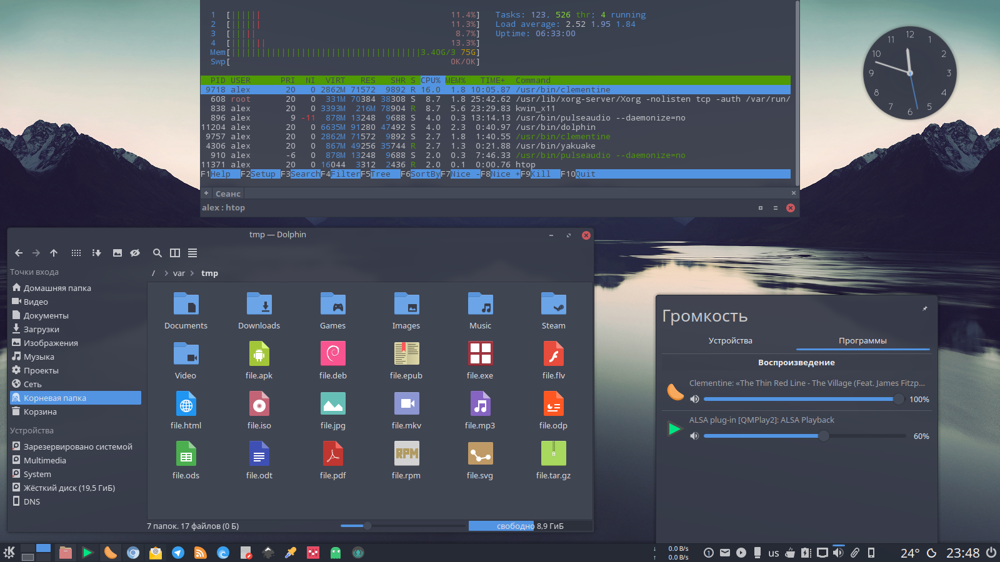
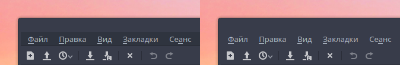

# Arc Dark KDE

On repository available:
- Plasma theme
- Aurorae theme
- Color scheme
- Yakuake skin
- Konsole colorscheme
- Kvantum themes

# Preview


# Recommends

- [Arc Dark GTK Theme](https://github.com/horst3180/arc-theme)

- [Papirus Icon KDE Theme](https://github.com/PapirusDevelopmentTeam/papirus-icon-theme-kde)

# Install

**For Archlinux, Manjaro, Netrunner Rolling, Antergos (AUR):**

```
yaourt -S arc-dark-suite-git
```

Big thx [FadeMind](https://github.com/FadeMind) for PKGBUILD :)

**For other distros:**

```
git clone https://github.com/varlesh/Arc-Dark-KDE.git
cp -R Arc-Dark-KDE/{aurorae,color-schemes,plasma,konsole,yakuake,Kvantum} ~/.local/share/
```

# Fix color menubar on GTK


Add bash alias **fix-menubar** (for easy fix color menubar after upgrade Arc Dark GTK Theme):
```
echo 'alias fix-menubar="sudo bash ~/.local/share/plasma/desktoptheme/Arc-Dark/fix-menubar.sh"' >> ~/.bashrc
```

# Extra install

- [Firefox theme](https://github.com/varlesh/Arc-Dark-KDE/tree/master/extra/firefox)
- [DeaDBeeF style](https://github.com/varlesh/Arc-Dark-KDE/tree/master/extra/deadbeef)
- [VLC skin](https://github.com/varlesh/VLC-Arc-Dark)
- [Nylas N1 theme](https://github.com/varlesh/Nylas-Arc-Dark-Theme)

# DONATE
If you like my project , you can donate:

<span class="paypal"><a href="https://www.paypal.me/varlesh" title="Donate to this project using Paypal"></a></span>

<span class="Yandex.Money"><a href="http://yasobe.ru/na/varlesh#form_submit" title="Donate to this project using Yandex.Money"></a></span>
